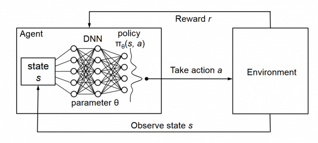
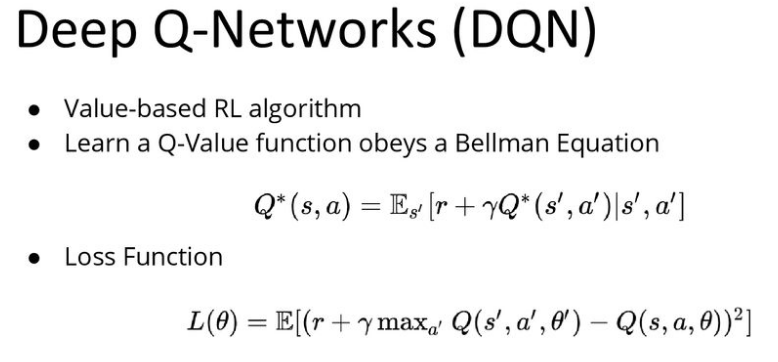
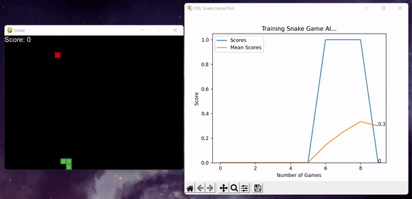
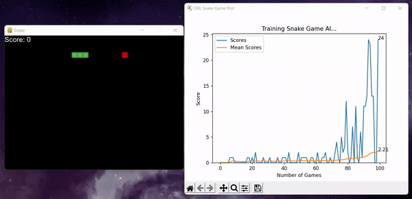
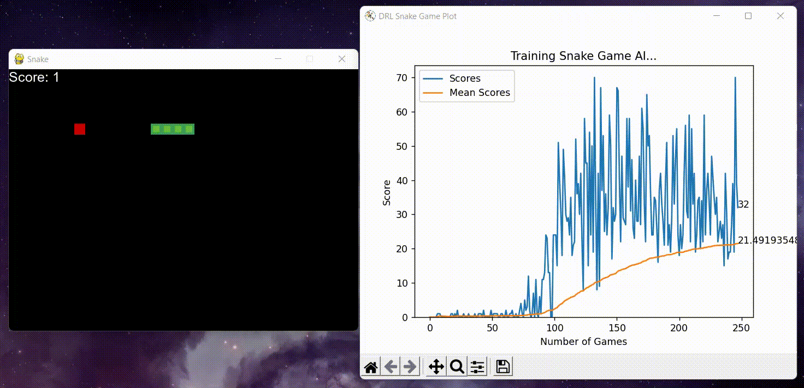

# Snake Game AI built with Reinforcement Learning (DQN)

## Notes
The `requirements.txt` file should list all Python libraries that your notebooks
depend on, and they will be installed using:

```
pip install -r requirements.txt
```

## Overview of Deep Q Learning



## Demo
### Trained for 10 games


### Trained for 100 games


### Trained for 250 games

